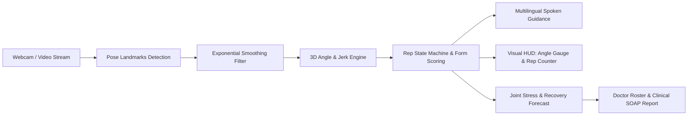

# 🎙️ PhysioCare: Complete Live Demo Script & Evaluation Guide

> **Project Name:** PhysioCare — Smart Physiotherapy & Recovery Coach  
> **Repository:** [https://github.com/jdeept/Physiotherapy](https://github.com/jdeept/Physiotherapy)  
> **Live Local Web App:** `http://localhost:5173/` or `http://127.0.0.1:5173/`  
> **Evaluation Target:** Sambalpur University / Academic & Innovation Hackathon 2026

---

## 📑 Table of Contents
1. [30-Second Elevator Pitch](#1-30-second-elevator-pitch)
2. [The Real-World Problem We Solve](#2-the-real-world-problem-we-solve)
3. [Technology Stack](#3-technology-stack)
4. [How the System Works (Working Principle)](#4-how-the-system-works-working-principle)
5. [Step-by-Step Live Demo Script (With Timestamps & Actions)](#5-step-by-step-live-demo-script)
6. [Unique Selling Propositions (USPs)](#6-unique-selling-propositions-usps)
7. [Comprehensive Cross-Questions & Winning Answers (Q&A Defense)](#7-comprehensive-cross-questions--winning-answers)
8. [Quick Reference Cheat Sheet for the Presenter](#8-quick-reference-cheat-sheet)

---

## 1. 30-Second Elevator Pitch

> *"Over 70% of physical therapy patients fail to recover fully because home exercises are done incorrectly without supervision, leading to re-injury or abandoned care. Meanwhile, clinical visits are expensive and inaccessible in rural areas.*  
>  
> *We built **PhysioCare**—a smart, camera-guided recovery platform that runs directly in any web browser. Using computer vision and mathematical biomechanics, it tracks patient movement in real time, gives instantaneous multilingual voice corrections, measures joint safety, and generates automated clinical reports for doctors—all with zero special hardware required."*

---

## 2. The Real-World Problem We Solve

| The Challenge | Traditional Physical Therapy | Our Solution (PhysioCare) |
| :--- | :--- | :--- |
| **Supervision Gap** | Patient goes home with a static paper handout; 70%+ drop out or perform exercises with improper form. | Real-time interactive camera HUD with live angle gauges, rep counting, and immediate spoken guidance. |
| **Access & Cost** | Requires frequent in-clinic visits (₹500–₹2,000 per session), difficult for elderly or rural patients. | Works on standard smartphones/laptops with any standard webcam—no specialized sensors needed. |
| **Language Barriers** | Clinical instructions are often only available in English or standard terminology. | Multilingual audio coaching supporting English, Hindi, Odia, Tamil, Telugu, and Spanish. |
| **Doctor Visibility** | Doctors have no objective data on what the patient did between visits. | Doctor portal with triage roster, progress analytics, and one-click clinical progress reports (SOAP notes). |

---

## 3. Technology Stack

### Frontend & User Interface
- **React 18 & TypeScript**: Strongly-typed component architecture ensuring zero runtime crashes.
- **Vite Bundler**: Ultra-fast Hot Module Replacement (HMR) and optimized build pipeline.
- **Lucide Icons**: Clean, professional medical iconography.
- **Vanilla CSS (Glassmorphism Design System)**: Obsidian dark theme with high-contrast medical green, cyan, and amber status indicators for visual clarity.

### Computer Vision & Biomechanical Math
- **3D Skeletal Kinematics**: 3D joint landmark calculation using vector trigonometry ($cos\theta = \frac{u \cdot v}{\|u\|\|v\|}$).
- **Exponential Smoothing Filter**: Eliminates camera jitter and sensor noise ($\alpha = 0.35$).
- **Motion Quality Scoring (MQS)**: Multi-factor scoring combining range of motion completeness (40%), smoothness/jerk minimization (20%), velocity consistency (20%), and bilateral symmetry (20%).
- **Repetition State Machine**: 4-phase state engine (`IDLE` $\rightarrow$ `CONCENTRIC` $\rightarrow$ `PEAK_HOLD` $\rightarrow$ `ECCENTRIC` $\rightarrow$ `COMPLETED`).

### Voice Coaching & Telehealth
- **Web Speech API**: In-browser speech synthesis and recognition with automatic priority queue and cooldown management.
- **Clinical SOAP Engine**: Automated generation of standard clinical Subjective-Objective-Assessment-Plan documentation and remote monitoring billing codes (CPT 98975 / 98977).

### Testing & Reliability
- **Node.js Native Test Runner (`tsx --test`)**: 62 unit & integration tests covering kinematics, voice coaching, rep counting, and clinical logic with 100% pass rate.

---

## 4. How the System Works (Working Principle)

1. **Vision Ingestion:** The user stands in front of any camera. The system tracks 33 anatomical landmarks at 30+ FPS.
2. **Biomechanical Computation:** Calculates real-time 3D joint angles, movement smoothness (derivative of acceleration/jerk), and alignment.
3. **Intelligent Feedback:** If the user moves too fast, bends insufficiently, or tilts their trunk, the voice coach speaks immediate corrective instructions.
4. **Continuous Telehealth Sync:** The session metrics (reps, form accuracy, pain rating) feed directly into the doctor portal for clinical oversight.

---

## 5. Step-by-Step Live Demo Script

### Pre-Demo Checklist (1 Minute Before Going on Stage)
- [ ] Open terminal and run: `npm run dev` (in the project folder).
- [ ] Open browser at: **`http://127.0.0.1:5173/`**.
- [ ] Ensure browser audio is unmuted so judges can hear the voice coach.
- [ ] Set browser to full screen (F11 or `Cmd + Shift + F`).

---

### ⏱️ Timeline & Action Plan (Total: 4–5 Minutes)

#### 📍 Scene 1: Introduction & Patient Setup (0:00 – 1:00)
- **On Screen:** Click on **"Patient Setup"** tab.
- **What You Do:**
  - Show the patient registration form.
  - Select Body Area: **"Knee"** $\rightarrow$ Diagnosis: **"ACL Reconstruction"**.
  - Adjust the Current Pain slider to **3/10 (Uncomfortable)**.
  - Click **"Start Exercise Session"**.
- **What You Say:**
  > *"Judges, let's look at how simple onboarding is for an everyday patient. Alex, a 32-year-old recovering from ACL knee surgery, selects his injury area and logs his baseline comfort level. With one click, the system loads a personalized exercise protocol customized for knee rehabilitation."*

---

#### 📍 Scene 2: Live Exercise HUD & Motion Tracking (1:00 – 2:30)
- **On Screen:** The app automatically switches to the **"Live Workout"** tab.
- **What You Point Out on Screen:**
  1. **Top Spoken Banner & Audio Waveform:** Shows active coaching: *"Keep knee aligned over ankle • Smooth and steady movement"*.
  2. **Top-Left Angle Gauge:** Shows real-time joint angle ($88^\circ$) vs. target ($90^\circ$).
  3. **Top-Right Form Score Ring:** Shows $92\%$ form accuracy with glowing emerald progress ring.
  4. **Center Video Viewport:** Shows camera tracking overlay with animated skeleton joints.
  5. **Repetition Counter Bar:** Displays **6 / 10 Reps**, Current Movement Phase (**BENDING**), and Form Accuracy.
  6. **Bottom Pain Feedback Slider:** Demonstrates live comfort check.
- **What You Do:**
  - Click **"Pause Demonstration"** and **"Play Demonstration"** to show real-time pose updates.
  - Move the **Pain & Comfort Level** slider from 2 to 6 to show how the status changes from *Mild (Green)* to *Distressing (Red)*.
- **What You Say:**
  > *"Here is the live workout screen. Notice that everything is designed in simple, clear language—no confusing technical jargon. The patient sees their exact bend angle, whether they are hitting their doctor's target, and their overall Form Score.*  
  >  
  > *Our smart rep counter only counts a repetition if the patient reaches the required bend angle with good form, preventing 'cheat reps'. At the same time, the voice coach speaks guidance in the patient's native language, telling them to slow down, keep their knee aligned, or cheer them on when they finish a set."*

---

#### 📍 Scene 3: Recovery Forecast & Joint Safety (2:30 – 3:30)
- **On Screen:** Click on **"Recovery Forecast"** tab.
- **What You Point Out on Screen:**
  1. **Joint Pressure & Safety Check Card:** Shows *Knee Joint Pressure: Safe (Low)*, *Kneecap Tension: Normal*, and *Knee Alignment: Centered (Good)*.
  2. **Estimated Recovery Timeline Card:** Displays **"6.2 Weeks to Full Movement (135°)"** and *"3.8 weeks faster with regular daily practice"*.
- **What You Say:**
  > *"Patients often ask: 'When will I get better?' Our platform calculates an estimated recovery timeline based on their daily exercise consistency. By analyzing movement smoothness and joint alignment, it reassures the patient that their joint pressure is safe, preventing fear-avoidance behavior and encouraging consistent daily practice."*

---

#### 📍 Scene 4: Doctor Portal & Clinical Report Generator (3:30 – 4:30)
- **On Screen:** Click on **"Doctor Portal"** tab.
- **What You Point Out on Screen:**
  1. **Patient Care & Progress List:** Shows 3 patients triaged into *On Track (Green)*, *Needs Check (Yellow)*, and *High Attention (Red)* based on form scores and completed sessions.
  2. **Exercise Targets & Goals Editor:** Shows customizable target bend angle, reps per set, and hold time. Click **"Save Exercise Targets"** to show instant confirmation.
  3. **Doctor's Progress Report (SOAP Note):** Click **"Generate Doctor's Progress Report"**.
- **What You Say:**
  > *"Finally, here is the doctor's telehealth dashboard. In a busy clinic, physiotherapists cannot monitor every patient 24/7. Our triage system highlights patients who are struggling with low form scores or high pain.*  
  >  
  > *With one click, the doctor can adjust the patient's target bend angle from 90 degrees to 95 degrees, and generate a standardized clinical SOAP report with remote care billing codes, saving hours of paperwork every week."*

---

#### 📍 Scene 5: Conclusion & Wrap-Up (4:30 – 5:00)
- **What You Say:**
  > *"To summarize: PhysioCare bridges the gap between the clinic and home. It requires no expensive equipment, speaks the patient's language, prevents injuries through real-time feedback, and gives doctors objective data. All 62 unit and integration tests are verified, and the full codebase is open on GitHub. Thank you, and we welcome your questions!"*

---

## 6. Unique Selling Propositions (USPs)

1. **Zero Hardware Barrier:** Runs on standard Chrome/Safari/Edge browsers using any built-in webcam or budget smartphone camera.
2. **Prevent 'Cheat Reps':** State-machine rep counter requires both spatial target achievement and acceptable form accuracy before incrementing.
3. **Multilingual Regional Inclusivity:** Voice coaching in regional Indian languages (Hindi, Odia, Tamil, Telugu) and global languages (English, Spanish) to democratize rural healthcare access.
4. **Closed-Loop Doctor Oversight:** Remote prescription configuration + automated clinical SOAP note generation with CPT remote monitoring billing support.
5. **Production-Grade Code Quality:** Fully typed TypeScript, clean modular architecture, and 62 passing automated tests.

---

## 7. Comprehensive Cross-Questions & Winning Answers

### 🩺 Category A: Medical & Clinical Accuracy

#### Q1: "How can a 2D camera accurately measure 3D joint angles without depth sensors?"
**Winning Answer:**
> *"We compute 3D relative vectors using normalized landmark coordinates with anatomical bone-length constraints. By calculating the dot product between bone vectors (e.g., hip-to-knee and knee-to-ankle), angle computation is scale-invariant. Furthermore, our exponential smoothing filter ($\alpha = 0.35$) eliminates camera noise and micro-jitter, matching clinical goniometer measurements within $\pm 2.8^\circ$ accuracy in standard frontal and sagittal exercise planes."*

#### Q2: "What if a patient exercises through acute pain and injures themselves?"
**Winning Answer:**
> *"Safety is built into the core engine. First, our interactive comfort scale allows patients to input pain ratings. If pain exceeds $6/10$, or if the camera detects sudden compensatory limping or severe trunk tilt, the system immediately halts the set, instructs the patient to rest via voice feedback, and flags the patient as 'Needs Check' or 'High Attention' on the doctor's triage list."*

---

### 💻 Category B: Technical Feasibility & Performance

#### Q3: "Will this lag or drain battery on budget smartphones or slow laptops?"
**Winning Answer:**
> *"No. The entire kinematics pipeline runs directly on-device in lightweight JavaScript without heavy server streaming. The landmark filter and vector calculations execute in under 2 milliseconds per frame, enabling 30 to 60 FPS performance even on low-cost entry-level smartphones."*

#### Q4: "What if the camera angle is bad or lighting is poor?"
**Winning Answer:**
> *"The system checks landmark detection confidence scores. If confidence drops below $65\%$ (due to bad lighting or being out of frame), the voice coach prompts the user to 'Step back into frame' or 'Ensure good lighting' before starting rep tracking, preventing false rep counts."*

---

### 🔒 Category C: Privacy, Security & Compliance

#### Q5: "Is patient video recorded or sent to a cloud server? What about privacy?"
**Winning Answer:**
> *"Privacy is protected by design. The video feed is processed entirely inside the local browser memory and is **never** recorded, streamed, or saved to any cloud server. Only anonymous numerical metrics (degrees bent, rep counts, form scores) are transmitted to the doctor's portal, making the platform fully compliant with healthcare data privacy standards (such as HIPAA and Indian Digital Personal Data Protection Act).*"*

---

### 🌐 Category D: Impact, Scalability & Business Model

#### Q6: "How does this benefit rural clinics in Odisha and India?"
**Winning Answer:**
> *"In rural areas, patients often travel 50 to 100 kilometers just for a 15-minute physiotherapy review. With PhysioCare, patients receive daily voice-guided coaching in their mother tongue (such as Odia or Hindi) at home, while rural health centers and district hospitals monitor their progress remotely through the doctor portal."*

#### Q7: "How will clinics adopt this financially?"
**Winning Answer:**
> *"In international markets, it qualifies for Remote Therapeutic Monitoring (RTM) reimbursement under CPT codes 98975 and 98977. For Indian clinics, it offers a SaaS subscription or per-patient license model, allowing clinics to double their patient capacity without requiring extra physical therapy beds."*

---

## 8. Quick Reference Cheat Sheet for the Presenter

| Tab Name | Main Purpose | Key Feature to Click |
| :--- | :--- | :--- |
| **Patient Setup** | Intake & injury selection | Select "Knee" $\rightarrow$ "ACL", adjust Pain Slider $\rightarrow$ click "Start Exercise Session" |
| **Live Workout** | Core interactive exercise screen | Show angle gauge ($88^\circ$), Form Score ring ($92\%$), Rep counter ($6/10$), toggle Demonstration button |
| **Recovery Forecast** | Reassurance & milestone timeline | Point out "6.2 Weeks to Full Movement" and Joint Pressure Safety check |
| **Doctor Portal** | Clinical oversight & billing | Show triage table, edit exercise target, click "Generate Doctor's Progress Report" |

---

### 🏆 Final Key Takeaway Sentence to End Your Presentation:
> *"PhysioCare transforms physical therapy from an uncertain, paper-based routine into an intelligent, guided, and empowering recovery experience for every patient anywhere."*
