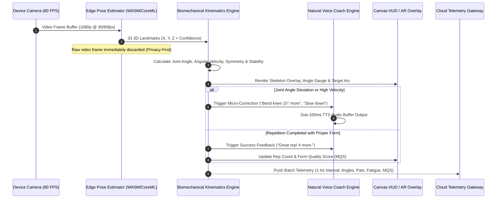

# 🏗️ System Architecture & Infrastructure Specification
### AI Recovery Companion (PhysioAI)

---

## 1. High-Level Architectural Topology

The system uses a **Hybrid Edge-Cloud Architecture**. High-frequency compute (pose estimation, joint vector computation, audio coaching, fall detection) runs 100% on-device at 30–60 FPS with sub-50ms latency. Aggregated biomechanical telemetry, session summaries, adaptive AI planning, and clinical coordination run in a HIPAA-compliant cloud environment.

```
+---------------------------------------------------------------------------------------------------+
|                                      EDGE CLIENT (Mobile / Tablet / Web)                          |
|                                                                                                   |
|  [ RGB Camera ] ---> [ Edge Vision Pipeline (MediaPipe/ONNX) ] ---> [ 3D Joint Kinematics Engine ]|
|                                                                                    |              |
|  [ Voice Coach (TTS/STT) ] <--- [ Rule & LLM Micro-Coaching ] <--------------------+              |
|                                                                                    |              |
|  [ 3D Digital Twin Viewer ] <--- [ Local Mesh & ROM State ] <----------------------+              |
|                                                                                    |              |
|  [ UI Render Loop (60fps) ]                                                        |              |
+------------------------------------------------------------------------------------+--------------+
                                                                                     |
                                                      Encrypted WebSocket / WebRTC   | (Telemetry &
                                                      Telemetry Stream (<5 KB/s)     |  State Sync)
                                                                                     v
+---------------------------------------------------------------------------------------------------+
|                                      HIPAA-COMPLIANT CLOUD BACKEND                                |
|                                                                                                   |
|  +---------------------------+  +-------------------------------+  +---------------------------+  |
|  | Realtime Gateway (WSS)    |  | Adaptive Plan Synthesizer     |  | Clinical Analytics Engine |  |
|  | - Auth & Token Enclave    |  | - Recovery Milestone Engine   |  | - ROM Trend Aggregation   |  |
|  | - Session State Manager   |  | - Pain/Fatigue Reactive Agent |  | - Anomaly & Fall Dispatch |  |
|  +-------------+-------------+  +---------------+---------------+  +-------------+-------------+  |
|                |                                |                                |                |
|  +-------------v--------------------------------v--------------------------------v-------------+  |
|  | Event Bus & Messaging: Redis Pub/Sub + Kafka (Biomechanical Events)                        |  |
|  +---------------------------------------------+-----------------------------------------------+  |
|                                                |                                                  |
|  +---------------------------------------------v-----------------------------------------------+  |
|  | Secure Persistence Layer: PostgreSQL (TimescaleDB for Kinematics) + S3 (Prescriptions/PDFs)|  |
|  | Compliant with FHIR / HL7 standard endpoints                                               |  |
|  +---------------------------------------------------------------------------------------------+  |
+---------------------------------------------------------------------------------------------------+
```

---

## 2. Low-Latency Edge Vision & Feedback Loop

To give patients natural, instantaneous voice and visual feedback, the critical feedback path runs entirely within the client runtime:



---

## 3. Privacy, Security & Regulatory Compliance

1. **Zero Raw Video Storage by Default**:
   - Camera frames are processed strictly in GPU memory buffers and instantly discarded.
   - Only mathematical landmark matrices `(x, y, z, c)` and aggregated kinematic scores are transmitted or recorded.
2. **HIPAA & GDPR Compliant Enclave**:
   - AES-256 encryption at rest; TLS 1.3 encryption in transit with certificate pinning.
   - Role-Based Access Control (RBAC) separating Patient, Clinician, Caregiver, and Admin.
3. **FHIR / HL7 Clinical Interoperability**:
   - Export standard HL7 FHIR `Observation`, `CarePlan`, `DiagnosticReport`, and `Condition` resources for EHR (Epic, Cerner, AthenaHealth) ingestion.
4. **Audit Trails & Medical Liability Logging**:
   - Immutable audit logs of doctor prescription adjustments, AI plan recommendations, and clinical override events.

---

## 4. Scalable Microservices Decomposition

To avoid monolithic code bloat and support massive multi-tenant scale:

| Microservice | Primary Responsibility | Tech Stack |
| :--- | :--- | :--- |
| **`gateway-service`** | Edge routing, JWT validation, rate limiting, WebRTC signaling | Node.js / Fastify / WebSocket |
| **`patient-service`** | Patient profiles, medical history, baseline injury & surgery metadata | Go / PostgreSQL |
| **`plan-synthesizer-service`** | AI generation of progressive rehab routines based on clinical constraints | Python (FastAPI) / LangGraph / PyTorch |
| **`kinematics-telemetry-service`**| Ingests time-series joint telemetry, computes MQS & biomechanical curves | Go / TimescaleDB |
| **`doctor-copilot-service`** | LLM assistant for clinician summaries, prescription NLP, anomaly flags | Python / FastAPI / Claude/Gemini API |
| **`pdf-report-generator`** | Headless Chrome/Weasyprint generating weekly clinical PDF documentation | Node.js / Puppeteer |
| **`notification-service`** | Smart morning/evening push notifications, emergency SMS/Calls (Twilio) | Go / Redis Streams / FCM |

---

## 5. Network Resiliency & Offline-First Strategy

Patients frequently exercise in areas with unstable internet (basements, remote clinics):
- **Local SQLite / IndexedDB Storage**: All exercises, skeleton configs, audio speech models, and session logs work 100% offline.
- **Bi-directional Delta Sync**: Sync queue flushes telemetry to cloud once connectivity resumes.
- **On-Device Voice Synthesis**: Offline neural TTS models fallback smoothly if network TTS is unavailable.
