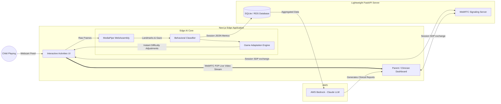

# 🌟 Snowie

**Snowie** is an intelligent, AI-driven behavioral tracking and therapy adaptation platform designed to support children with neurodevelopmental needs (such as ASD or ADHD). 

Through engaging, game-like activities, Snowie continuously analyzes a child's real-time biometric telemetry (gaze, posture, movement) and dynamically adjusts the sensory load and difficulty to keep them in their optimal zone of development.

---

## ✨ Key Features

- 🎮 **Interactive Child Activities**: A suite of beautiful, distraction-free games designed to test and improve natural interaction, imitation, emotion recognition, and sustained attention.
- 🧠 **Real-Time AI Telemetry**: Uses MediaPipe and custom behavioral engines to track head posture, gaze aversions, blink rates, and repetitive movements (like hand flapping or body rocking) directly from the device's camera.
- 🔄 **Dynamic Adaptation**: The `grow` engine instantly scales activity difficulty and sensory feedback up or down based on the child's real-time cognitive load and frustration levels.
- 📊 **Live Parent Monitor**: A real-time dashboard where parents or clinicians can watch a live stream of the session alongside active behavioral event logs and telemetry graphs.
- 📝 **Automated Clinical Reports**: Integrates with **AWS Bedrock (Claude)** to synthesize raw session telemetry into beautifully formatted, actionable clinical reports and recommendations.

---

## 📂 Architecture & Workflow (Zero-Lag Edge AI)

Snowie is built using a highly optimized **Edge Computing** and **WebRTC Peer-to-Peer** architecture. By processing AI completely on the device, we achieve zero-latency game adaptation while saving massive amounts of cloud compute costs.

- **Frontend (`/frontend`)**: A Next.js 15 application running **MediaPipe via WebAssembly** directly in the browser. It tracks gaze and posture with sub-50ms latency to adapt the game instantly. It also acts as a WebRTC host to securely stream video directly to the parent's device peer-to-peer.
- **Backend (`/backend`)**: A lightweight FastAPI Python server. Instead of heavy video processing, it now simply acts as a WebRTC Signaling Server (to connect the parent and child devices) and a REST API for storing final session metrics in the database.
- **AWS Cloud (`/docs`)**: Final telemetry data is passed to AWS Bedrock (Claude) to generate automated clinical progress reports without AWS ever processing or storing heavy video files.
