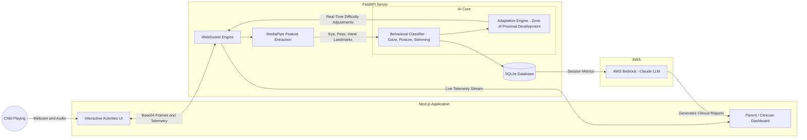

# 🌟 Snowie

**Snowie** is an intelligent, AI-driven behavioral tracking and therapy adaptation platform designed to support children with neurodevelopmental needs (such as ASD or ADHD). 

Through engaging, game-like activities, Snowie continuously analyzes a child's real-time biometric telemetry (gaze, posture, movement) and dynamically adjusts the sensory load and difficulty to keep them in their optimal zone of development.

---

## ✨ Key Features

- 🎮 **Interactive Child Activities**: A suite of beautiful, distraction-free games designed to test and improve natural interaction, imitation, emotion recognition, and sustained attention.
- 🧠 **Real-Time AI Telemetry**: Uses MediaPipe and custom behavioral engines to track head posture, gaze aversions, blink rates, and repetitive movements (like hand flapping or body rocking) directly from the device's camera.
- 🔄 **Dynamic Adaptation**: The `grow` engine instantly scales activity difficulty and sensory feedback up or down based on the child's real-time cognitive load and frustration levels.
- 📊 **Live Parent Monitor**: A real-time dashboard where parents or clinicians can watch a live stream of the session alongside active behavioral event logs and telemetry graphs.
- 📝 **Automated Clinical Reports**: Integrates with **AWS Bedrock (Claude)** to synthesize raw session telemetry into beautifully formatted, actionable clinical reports and recommendations.

---

## 📂 Architecture & Workflow

Snowie is built with a highly responsive, decoupled architecture to process high-frequency video telemetry in real-time.

- **Frontend (`/frontend`)**: A Next.js 15 (App Router) application built with Tailwind CSS v4. It features a colorful, playful UI for the child activities and a clean, professional dashboard for parents and clinicians.
- **Backend (`/backend`)**: A FastAPI Python server handling high-frequency WebSocket connections, executing the AI feature extraction pipeline (MediaPipe), and managing the SQLite database.
- **Documentation (`/docs`)**: Contains the core `AI_WORKFLOW.md` detailing the deep learning and feature extraction pipeline for SIH judges.
